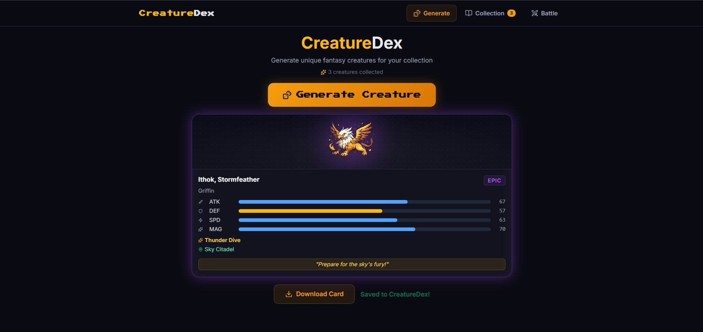
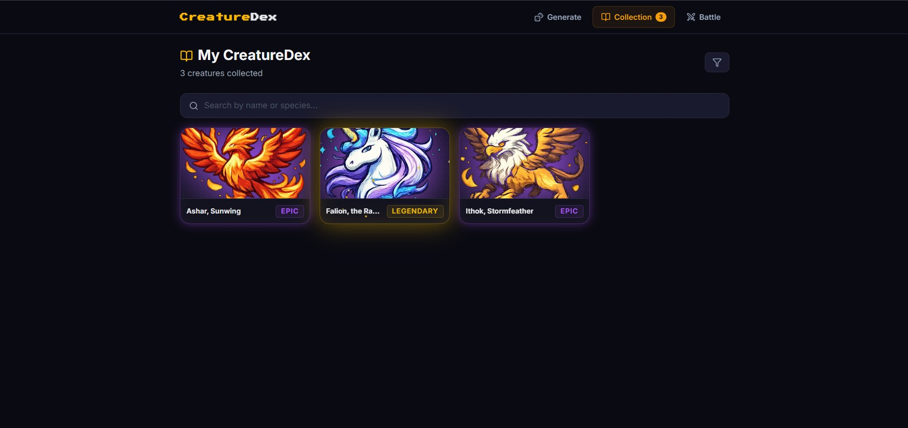
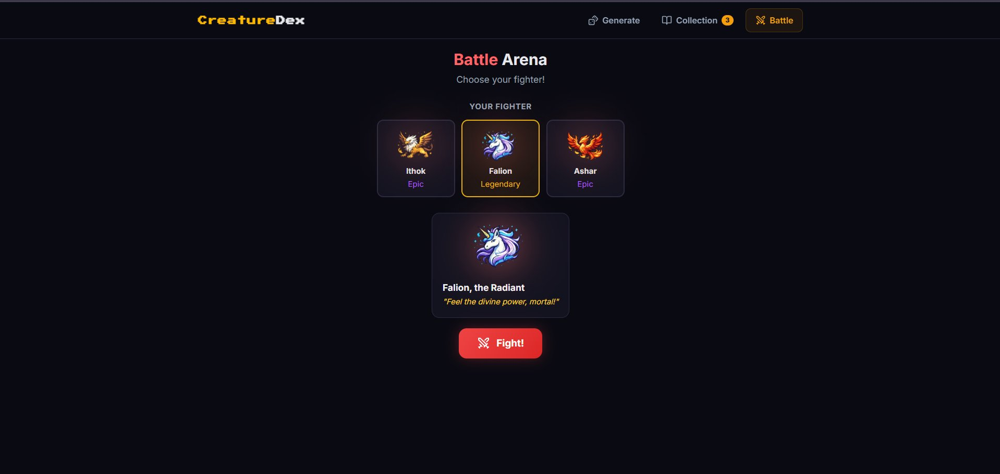
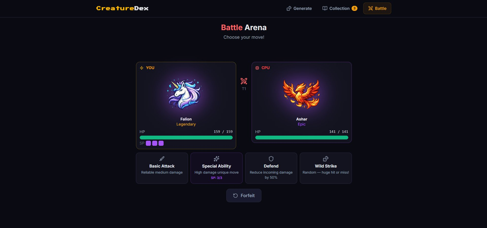
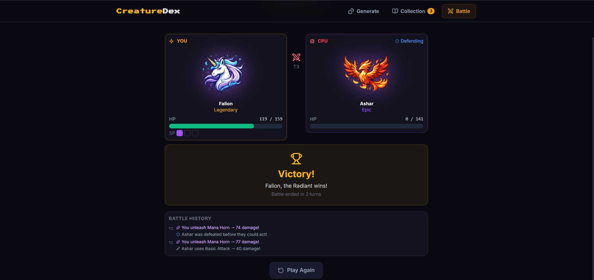

# CreatureDex

A fantasy creature card game built with React, TypeScript, and Tailwind CSS. Generate unique creatures powered by AI-written lore, collect them in your personal Dex, and battle them against CPU opponents in a turn-based arena.

---

## Features

**Generate**
- Randomized creature generation across 10 species and 5 rarity tiers (Common through Mythic)
- AI-generated lore and battle taunts via OpenRouter (served through a local Express backend)
- Animated rarity effects — glows, particle bursts, and floating animations scale with rarity tier
- Download individual creature cards as PNG images

**Collection**
- Persistent local storage for your saved creatures
- Search by name or species, filter by rarity, sort by newest, oldest, or rarity tier
- Click any card to open a full-detail modal with a download option
- Delete creatures with a two-step confirmation

**Battle Arena**
- Pick any creature from your collection and face a randomly selected CPU opponent
- Turn-based combat with four move types: Basic Attack, Special Ability, Defend, and Wild Strike
- Speed-based turn order — faster creatures go first more often
- SP (Special Points) system limits use of high-damage special moves
- Animated attack and hit sequences with floating damage numbers
- Battle history log with per-turn breakdown

---

## Tech Stack

| Layer | Technology |
|---|---|
| Frontend | React 19, TypeScript, Vite 8 |
| Styling | Tailwind CSS v4, custom CSS animations |
| Icons | Lucide React |
| Card Export | modern-screenshot (domToPng) |
| Backend | Node.js, Express |
| AI Lore | OpenRouter API (model: openrouter/auto) |
| Storage | Browser localStorage |

---

## Project Structure

```
creature-generator/
├── screenshots/
│   ├── 01_generate_page.png
│   ├── 02_collection_page.png
│   ├── 03_battle_select.png
│   ├── 04_battle_combat.png
│   └── 05_victory_screen.png
├── src/
│   ├── components/
│   │   ├── creature/
│   │   │   ├── Crystal_Rabbit.png
│   │   │   ├── Dragon.png
│   │   │   ├── Forest_Guardian.png
│   │   │   ├── Griffin.png
│   │   │   ├── Pegasus.png
│   │   │   ├── Phoenix.png
│   │   │   ├── Raven_Spirit.png
│   │   │   ├── Shadow_Wolf.png
│   │   │   ├── Spirit_Fox.png
│   │   │   └── Unicorn.png
│   │   ├── CreatureArt.tsx       # Species image renderer with rarity glow effects
│   │   ├── CreatureCard.tsx      # Full and compact card layouts
│   │   └── CreatureModal.tsx     # Full-detail modal with download
│   ├── pages/
│   │   ├── GeneratorPage.tsx     # Creature generation flow
│   │   ├── CollectionPage.tsx    # Collection browser with filters
│   │   └── BattlePage.tsx        # Turn-based battle arena
│   ├── utils/
│   │   ├── creatureGenerator.ts  # Core generation logic (stats, names, lore templates)
│   │   ├── battleEngine.ts       # Combat resolution, move types, CPU AI
│   │   ├── aiGenerator.ts        # Calls backend for AI lore/taunt
│   │   └── storage.ts            # localStorage read/write helpers
│   ├── App.tsx
│   ├── index.css                 # All custom styles and CSS animations
│   └── main.tsx
├── backend/
│   ├── server.js                 # Express server, proxies OpenRouter requests
│   ├── .env.example
│   └── package.json
├── public/
└── package.json
```

---

## Getting Started

### Prerequisites

- Node.js 20 or higher
- An [OpenRouter](https://openrouter.ai) API key

### 1. Clone the repository

```bash
git clone git https://github.com/sindhuja8812/CreatureDex.git
cd CreatureDex
```

### 2. Install frontend dependencies

```bash
npm install
```

### 3. Set up and start the backend

```bash
cd backend
npm install
cp .env.example .env
```

Edit `backend/.env` and add your OpenRouter key:

```
OPENROUTER_API_KEY=your_openrouter_key_here
PORT=3001
```

Start the backend:

```bash
npm run dev
```

### 4. Start the frontend

In a separate terminal from the project root:

```bash
npm run dev
```

The app runs at `http://localhost:5173`. The frontend expects the backend at `http://localhost:3001`.

---

## How It Works

### Creature Generation

Each creature is built from randomized components:

- **Species** — one of 10 types (Dragon, Phoenix, Griffin, Unicorn, etc.), each with unique abilities and habitats
- **Rarity** — weighted random roll: Common (50%), Rare (25%), Epic (15%), Legendary (8%), Mythic (2%)
- **Stats** — ATK, DEF, SPD, MAG each rolled within rarity-appropriate ranges
- **Name** — generated from prefix/suffix tables combined with species-specific titles
- **Lore** — a local template fills in first, then the AI backend overwrites it with a unique sentence
- **Taunt** — AI-generated battle cry used in the arena pick screen

### Battle System

Combat is turn-based with simultaneous move selection. Speed determines who acts first (75% chance for the faster creature). The four moves are:

- **Basic Attack** — reliable mid-damage, scales with ATK stat
- **Special Ability** — high damage using both ATK and MAG; costs 1 SP (3 SP total per battle)
- **Defend** — reduces all incoming damage by 50% this turn
- **Wild Strike** — 20% miss chance, 40% normal hit, 40% critical hit for heavy damage

The CPU selects moves using weighted probabilities that factor in its own HP percentage and remaining SP.

---

## Screenshots

**Generate Page** — roll a creature and view its AI-generated lore and stats



**Collection** — browse, search, and filter your saved creatures



**Battle Arena (Fighter Select)** — choose your creature and view its battle taunt



**Battle Arena (Combat)** — live HP bars, SP tracking, move buttons, and animated sequences



**Victory Screen** — battle history log and result after combat ends



---

## Notes

- Creature images are stored locally under `src/components/creature/` as PNG files named by species (e.g., `Griffin.png`, `Shadow_Wolf.png`)
- AI lore generation requires both the backend server and a valid OpenRouter API key; if the request fails, a fallback taunt is used
- All collection data is stored in `localStorage` under the key `creatureDex_collection` — clearing browser storage will reset your Dex